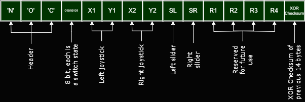

# DIY RC 

By Leonid Yurchenko, https://www.youtube.com/@nocomake

This is an Android application to connect to SPP bluetooth or TCP port and send RC commands.

- Includes corresponding code snippets to receive and parse the commands on the receiver end, 
see the `receivers` folder

- Uses binary protocol, keeping packets size small and allowing high frequency control

- Allows to send string messages back to the Android app to be
  displayed. That may include debug information, stats, battery voltage, etc.

- In addition to cotrol steram, allows to connect to video stream in parallel and 
  display the video stream between the joysticks for FPV-like experience. 
  
  Supports older style streams (MJPEG) as well as newer ones, like rtsp. Must be 
  switched in the app settings manually between the two, since I failed to find the control 
  that would display both types of streams, so there is ExoPlayer for newer streams
  and ipcam-view from https://github.com/niqdev/ipcam-view for MJPEG streams

# Protocol

Remote sends control data in packets of 15 bytes:

- 3 first bytes are the characters 'N', 'O', 'C' - a header that indicates a packet start
- 1 byte contains bitwise representation of 8 switches
- 2 bytes - X and Y axes of the left joystick. Each is a signed 8-bit integer, 0 when joystick is in the middle
- 2 bytes - X and Y axes of the right joystick
- 2 bytes - left and Right slider values, also signed 8-bit integers
- 4 bytes - reserved for the future usage
- 1 byte - XOR checksum of the previous 14 bytes



Remote accepts string messages and displays them on the screen. Every new message completely 
erases previous, so this is not a terminal or log, it's rather a remotely controlled short 
string display. For example, if a remote would send the following string:

```
rc.send(String("Voltage: ")+vStr+"\nTemp: "+tStr+"\nSpeed: "+sStr);
```

The following information will be displayed in the DIY RC app:

```
Voltage: 3.65
Temp: 20.2
Speed: 23
```

For more details see the code examples in the `receivers` folder.
